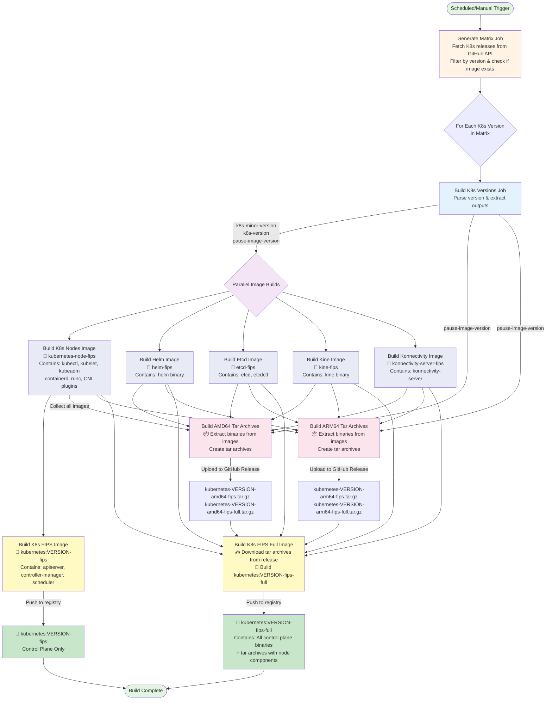

# How FIPS build work

This diagram shows how the CI is setup:

Component versions are sourced from `hack/kubernetes-v<MAJOR>.<MINOR>` files.
If the file does not exist in the repo, build is skipped.

[Click here if the diagram does render correctly in github](https://mermaid.live/edit#pako:eNq9V91u2zYUfhVCA4YWs9JY_oktDAVcJ27TIKmRZL1Y4gtaOrKJSJRBUmncOO8woA-wq-0F9mJ7hFEk5VCyrLQ384UgHn7nnI-HH4_oRydIQ3B8Z8Hwaomu391SJH9XAjPx6uYqWEKYxRC-Occ0wzG6ZmSxADZ7jVz3LXoPFBgWcI4FIw83xRDpMfqYzn-dszdvJyCCJTobcMQgBsyBo4ilCXpPxIdsjkbTUw0jsQCG5mt0D4yTlKKfkcwf3CESIZLgBSB4IFzwmeaon2UOita7jMThZx2DP05Shk6wIWCsKh-hhuiTHa_k_BxOOhfGG2Www_HtUqeYcbD4w4NgOBAozcQqqzCvxlXJNncD7iaEpsy9t7jmVnu8whkHVxWlsG-QTI7jGGIVmD8WQ3SqaqetpbWWHUqLvZCqsFeqxjqSIvDvn3_8g-6yOTAKArhL5bwbkRVXs-OUCkwo9xUkEHFLvcQg9AsOE4ULNA5Y2EIso0ELjS9O0SrOFtJ51kzyA8SJIZi_Vrktpa2OUG5Hc0IxW7-Q4EQEoUmQv1YTSFGHdQlye0s95bpfSHEm114UWb7u1FfaaouaY79rDWcppbL-5J6IdZHIMu0ktOZcDkxKqzb_LqxW2Vo0tqwmMpilqsnp9Gq_qPzPJ5dXp58u6ijgFdGJWygXEUvl6pmbYCpjSRs3jeslXptx7igPqKye7jF8o2GjJOx3rzEzbEfnx_0ukmM0YsGS3AM3jL_9jU7MIVc7QorupqNp2gzytih7KsLGe2YxUvLdVqlIbAGU_JoASjyNAHvTG4HVflTbaWq8G3d-xJJSMS_P_69imsT7i7kLqBSzBlBfzBrgDxSz5G3FKKqsA_y2ilMcIpEWH89L_UXd5NXUkxC2b6zGXJwhnMdRJ-lAlu5g8VV_V5qAbpTFsUHbJS64_gAlr5ZSHue7KG2BNZT0017-855MJFq1l2rPySdKjefbX-g4_UL1UixpafmZe8tzk9Lh9rQqRXK2w8ur4dV4aupQZXnXIcr6rs1UEngtolbhFaSF385oSUwzvswFwWAh72tsvUETeZrNTjQ1eVW5SqcfyZ0yLV7eDHDx5SOmHfxS3q4vRCxRfhmRPskqpUD33LryL9E-tuPpy1S3LHNeU8XrE43XpVzPq1aZTmj4yghxLMnJ2xDMXmukyVjA7CBcrGPQF3IUkTj2f4J21IO2PStd9s5VLsgaFkVRF_o2bKdhmXidyItCG1i5aph4HehFvbp4WtMm2ABwtJtVaboRoTTdiFCabkbYmm5GGnVsSzUMujugbV82qAC6EOyiilbZiHo-PvtSWkrSkGAA_WBoQwoJ2fNOS_6vI6HjC5ZBy0mAJTgfOo-5560jlpDArePL1xCzu1vnlj5JnxWmv6dpUrixNFssHT_CMZejbBVKNR0TLP8xJlsrAxoCG6cZFY7fGXoqiOM_Og-O3-55B91er3d45B12B0f9bq_lrB3fbR92ugdeRxoOvaN23-t3nlrOV5XYOxgeHnV6neHgqDdsd9re03_di_2b)

